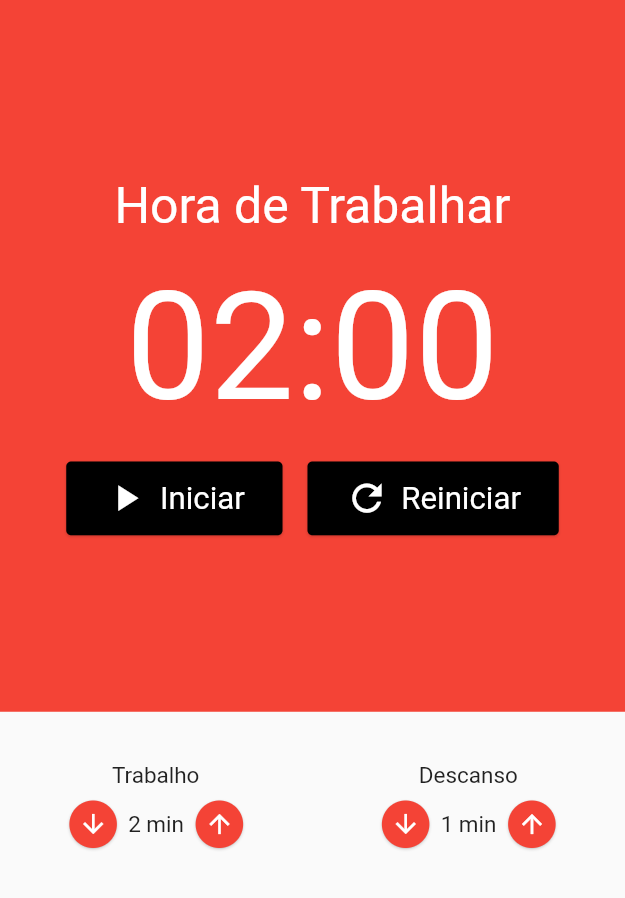
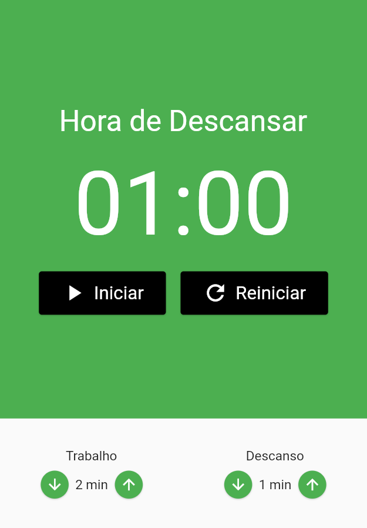

# ⏰ Pomodoro App Flutter

Aplicação Mobile Pomodoro em Flutter, desenvolvida durante o treinamento "Flutter e MobX: Desenvolva uma Aplicação Completa - Masterclass 2021" do canal **Cod3r Cursos** disponível no [YouTube](https://www.youtube.com/watch?v=LeRjIY4n2Vk).

## ⚙️ Informações adicionais

- Flutter v. 2.5.1
- Dart v. 2.14.2
- Google Fonts v. 1.0.0
- Mobx: v. 2.0.3
- Flutter Mobx: v. 2.0.1
- Provider: v.5.0.0
- Build Runner: v. 2.0.6
- Mobx Codegen: v. 2.0.2

Listar os dispositivos disponíveis

```flutter
  flutter devices
```

Inicializar a aplicação utilizando o Google Chrome

```flutter
  flutter run -d chrome --no-sound-null-safety
```

## 🖼️ Imagens

<div align="center">
  
  
</div>

## 📝 To Do

- [x] Mobx na Prática
- [x] Componentes Iniciais
- [x] Componente EntradaTempo #01
- [x] Componente Cronômetro
- [x] Componente Botão Cronômetro
- [x] Pomodoro Store #01
- [x] Componente EntradaTempo #02
- [x] Pomodoro Store #02
- [x] Pomodoro Store #03
- [x] Pomodoro Store #04
- [x] Pomodoro Store #05 <s>
- [ ] Testando no iOS
      </s>
- [ ] Melhorando a geração de código
